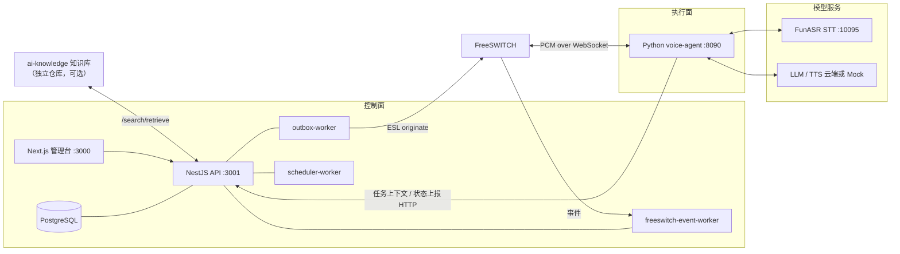

# AI Call — AI 外呼机器人

基于 FreeSWITCH + 实时语音大模型管线的 AI 外呼系统：控制面（NestJS）负责业务真相与任务编排，执行面（Python）负责每通电话的实时 STT → VAD → LLM → 工具调用 → TTS 循环，管理台（Next.js）提供全流程可视化配置。**所有 AI 供应商默认 Mock，不配任何 API Key 即可跑通完整链路。**

## 功能特性

- **外呼任务全生命周期**：批量任务、定时/重试调度、通话状态机（乐观锁单一转换通道）、转写与录音留存、结果导出
- **可视化流程编排**：拖拽式对话流程（React Flow），版本化发布 + 不可变快照执行，发布前校验（起止节点、悬空边、分支覆盖）
- **分层对话路由**：声学层回声门控（只判"是否有人说话"）→ 语义层结构化对话行为路由（业务回答/暂停/重复/插话/未回答，置信度分层）→ 状态机仅在高置信业务回答时前进
- **场景化配置**：话术人设（音色人设注入 LLM）、修复话术/静默处理/插话承接全部场景级可配、行业模板一键回显
- **RAG 知识库**：通话中实时检索（可对接独立的 ai-knowledge 知识库服务，按租户隔离）
- **浏览器模拟外呼**：首页直接用麦克风打测试电话（`/audio-stream` web 通道），无需话机
- **多租户 + RBAC**：组织/租户、细粒度权限码（全局 Guard 默认拒绝）、配额与用量计费、成本追踪
- **可观测性**：通话事件流、意图/打断结构化日志、健康检查、死信可视化

## 系统架构

三平面分离（控制面不碰音频，执行面不碰业务真相）：



1. **控制面 — `apps/api`（NestJS 10，端口 3001，前缀 `/api`）**：业务真相源。Postgres + Prisma（~34 模型）、RBAC、任务/流程生命周期。状态转换与副作用经 **outbox 模式**解耦：`outbox_events` 与任务状态同事务落库，worker 指数退避投递（最多 5 次，失败进死信）。
2. **执行面 — `services/voice-agent`（Python 3.11）**：每通电话的实时循环。从 FreeSWITCH 经 WebSocket 收 PCM，跑 VAD（webrtc/silero 可切）→ FunASR STT → RAG → LLM（OpenAI 兼容，工具调用）→ TTS 回流。经 HTTP 调 API 获取流程快照、上报状态。
3. **模型服务 — `services/funasr-server`（FastAPI）**：独立扩缩容的 STT/embedding 服务。

**关键不变量：流程版本不可变。** 任务创建时锁定 `flowVersionId`，永远执行该快照；编辑已发布流程会将其打回草稿，重新发布产生新版本——在途任务绝不受编辑影响。场景配置（话术/静默/音色）则优先取实时值，改配置对新通话立即生效、无需重发布。

## 目录结构

```
apps/api               NestJS 控制面（ESM，相对导入用 .js 后缀）
apps/dashboard         Next.js 14 管理台（App Router + Vitest）
packages/shared        跨端类型/DTO/场景定义（须先 build 再对 apps 做类型检查）
services/voice-agent   Python 实时语音代理（pytest）
services/funasr-server FunASR STT/embedding 服务（pytest）
freeswitch/            Docker 与本机 FreeSWITCH 配置（拨号计划、mod_audio_fork、ESL）
contracts/             TS/Python 跨端 JSON Schema 契约
docs/                  部署手册、权限设计、待办盘点等
```

## 快速开始

### 前置要求

- Node.js ≥ 18、pnpm 9（`packageManager` 已锁定）
- Python 3.11（voice-agent 与 funasr-server 各自 venv）
- PostgreSQL 与 Redis（本地或 Docker）
- Docker（可选，跑 FreeSWITCH；纯浏览器通道调试可不装）

### 安装与初始化

```bash
pnpm install                          # TS 工作区

# Python 执行面（voice-agent）
cd services/voice-agent
python -m venv .venv
.venv/Scripts/pip install -e ".[dev]"   # Windows；*nix 用 .venv/bin/pip
cd ../..

# FunASR（可选，STT 走本地模型时需要）
pnpm dev:funasr:setup

# 环境变量：复制模板，未填的项自动走 Mock
cp .env.example .env

# 数据库
pnpm --filter @ai-call/api prisma:migrate   # 本地开发迁移
pnpm demo:init                              # 种子：权限/角色/管理员/场景/流程/演示任务
```

默认管理员：`admin@ai-call.local` / `admin123`（见 `.env` 的 `DEFAULT_ADMIN_*`，生产必改）。

### 启动

```bash
pnpm dev              # turbo 起全部 dev server
# 或分别：
pnpm dev:api          # NestJS API      → http://localhost:3001/api
pnpm dev:dashboard    # 管理台          → http://localhost:3000
pnpm dev:agent-py     # 语音代理 WS     → ws://localhost:8090
pnpm dev:funasr       # FunASR STT      → :10095
pnpm dev:outbound     # 一键拉起外呼全链路（Windows，含 worker）
```

**不配任何 API Key**：LLM/TTS 走 Mock、STT 可用 mock 模型，浏览器模拟外呼与 `pnpm dev:agent-py:cli`（终端模拟对话）即可完整体验。接真实供应商时在 `.env` 设 `LLM_PROVIDER`（deepseek/qwen）、`TTS_PROVIDER`(qwen/cosyvoice)、STT（本地 FunASR 或阿里云百炼 Fun-ASR 实时）。

### 后台 worker（外呼必需，独立进程）

| 入口 | 职责 |
|---|---|
| `outbox-worker.main.ts` | 投递排队副作用（发起呼叫等），失败退避/死信 |
| `scheduler-worker.main.ts` | 定时/重试调度、卡死通话回收 |
| `freeswitch-event-worker.main.ts` | 订阅 ESL 事件流并入库 |

开发用 `pnpm dev:outbound` 一并拉起；生产用 PM2 跑编译产物（**运行时禁止 `nest build`**，见 `docs/deployment.md`）。

## 常用命令

```bash
pnpm check            # 完整门禁：shared 构建 + prisma generate + 双端类型检查 + 全部 TS/Python 测试
pnpm lint             # turbo lint（= tsc --noEmit 类型检查，非 ESLint）
pnpm test             # TS 测试（api + dashboard）
pnpm test:python:voice
pnpm --filter @ai-call/api prisma:generate   # schema.prisma 变更后必跑

# 单测过滤
cd apps/api && npx tsx --test src/tasks/outbound-business-flow.spec.ts
cd apps/dashboard && npx vitest -t "测试名"
cd services/voice-agent && .venv/Scripts/python -m pytest tests/test_agent.py -q

# FreeSWITCH
pnpm freeswitch:up / freeswitch:down          # Docker
pnpm microsip:local:setup                     # 本机 MicroSIP 联调
```

## 安全与生产部署

- `JwtAuthGuard` + `PermissionsGuard` **全局注册**，端点默认需认证与权限，公开路由需显式 `@Public()`
- 服务间鉴权：`SERVICE_API_TOKEN`（内部上下文/状态端点要求 `X-Service-Token`）、`VOICE_AGENT_WS_TOKEN`（语音 WS）——生产必须设置
- `CORS_ORIGINS` 白名单（生产禁 `*`）；集成连接器受 `INTEGRATION_CONNECTOR_ALLOWLIST` 约束；连接器响应绝不回传 `authConfig`
- 生产迁移用 `prisma migrate deploy`（**禁 `migrate dev`/`migrate reset`**）
- 拨号串：本机联调 `user/{to}` 直投话机；生产切 SIP 中继 `sofia/gateway/...`
- 完整上线步骤（构建顺序、PM2、健康检查、ai-knowledge 联合部署）见 **`docs/deployment.md`**

## 与 ai-knowledge 集成（可选）

独立的知识库产品（单独仓库），与 ai-call 同域部署时提供：统一联合登录（共享 JWT）、`/knowledge` 微前端内嵌、通话中 RAG 检索（`voice-agent → api → /search/retrieve`，service token + 租户隔离）。不配 `KNOWLEDGE_SERVICE_BASE_URL` 时使用内置 mock 知识库。详见 `docs/knowledge-base-microfrontend.md` 与 `docs/deployment.md` §10。

## 文档索引

| 文档 | 内容 |
|---|---|
| `docs/deployment.md` | 生产部署手册（PM2、构建顺序、健康检查、ai-knowledge 上线） |
| `docs/backlog.md` | 待办盘点（可靠性重构、VAD 演进、上线准备清单） |
| `docs/authz-architecture.md` | ai-call ↔ ai-knowledge 共享权限设计规范 |
| `docs/testing/operations-loop-regression.md` | 运营环闭回归清单（改动敏感模块时必读） |
| `contracts/*.schema.json` | TS/Python 跨端契约 |
| `CLAUDE.md` | AI 协作开发约定（工作区结构、命令、编码规范） |
