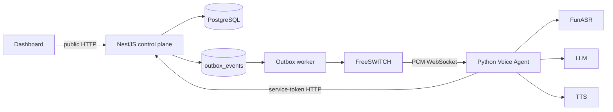

# Architecture v2

## Runtime topology



NestJS 是控制面和业务事实来源；Voice Agent 是实时执行面；FunASR 是可独立扩缩容的模型服务。

## Immutable flow execution

1. 编辑器保存 `TaskFlow` 草稿。
2. 发布前校验唯一开始节点、结束节点、悬空边、可达性和判断分支。
3. 发布生成不可变的 `TaskFlowVersion` 快照。
4. 创建任务时把 `flowId` 解析成最新发布版本，并写入 `flowVersionId`。
5. Voice Agent 从受保护的 `/api/tasks/:id/context` 获取快照并执行；未绑定流程时使用场景兼容模式。

已发布流程再次编辑会自动回到 `draft`，但旧任务继续使用原快照。

## Durable call lifecycle

- `outbound_tasks`：任务状态和锁定的流程版本。
- `transcript_turns`：逐轮转写，支持 `Idempotency-Key` 去重。
- `call_events`：状态、结果、派发和转人工审计轨迹。
- `outbox_events`：与任务状态同事务写入；worker 失败后指数退避，最多重试五次。

## Contracts and security

- `contracts/task-api.schema.json`：任务上下文和流程快照契约。
- `contracts/voice-websocket.schema.json`：FreeSWITCH/浏览器语音 WebSocket 消息契约。
- Python 入口使用 Pydantic 校验 HTTP 响应。
- 设置 `SERVICE_API_TOKEN` 后，内部上下文和状态上报必须携带 `X-Service-Token`。
- 设置 `VOICE_AGENT_WS_TOKEN` 后，语音 WebSocket 必须携带 token。
- `CORS_ORIGINS` 使用逗号分隔的明确来源；生产环境不要使用 `*`。
- `INTEGRATION_CONNECTOR_ALLOWLIST` 使用逗号分隔的连接器目标域名；集成中心只允许 `mock://` 或白名单内的 HTTPS 端点。

## Database migration

当前数据库已完成以下迁移：

- `20260627000000_init`：针对既有 `task_flows` 表建立迁移基线。
- `20260701190000_architecture_v2`：增加流程版本、任务、转写、事件和 outbox。
- `20260701193000_backfill_published_flows`：为既有已发布流程补建快照。

新环境执行：

```bash
pnpm --filter @ai-call/api prisma:generate
pnpm --filter @ai-call/api prisma:migrate
```

生产环境使用 `prisma migrate deploy`，不要运行 `migrate dev`。

## Verification

```bash
pnpm lint
pnpm test
pnpm build
pnpm test:python:voice
pnpm test:python:funasr
```

GitHub Actions 会分别验证 TypeScript 与 Python。FunASR CI 使用 mock 模型，不下载真实模型权重。
