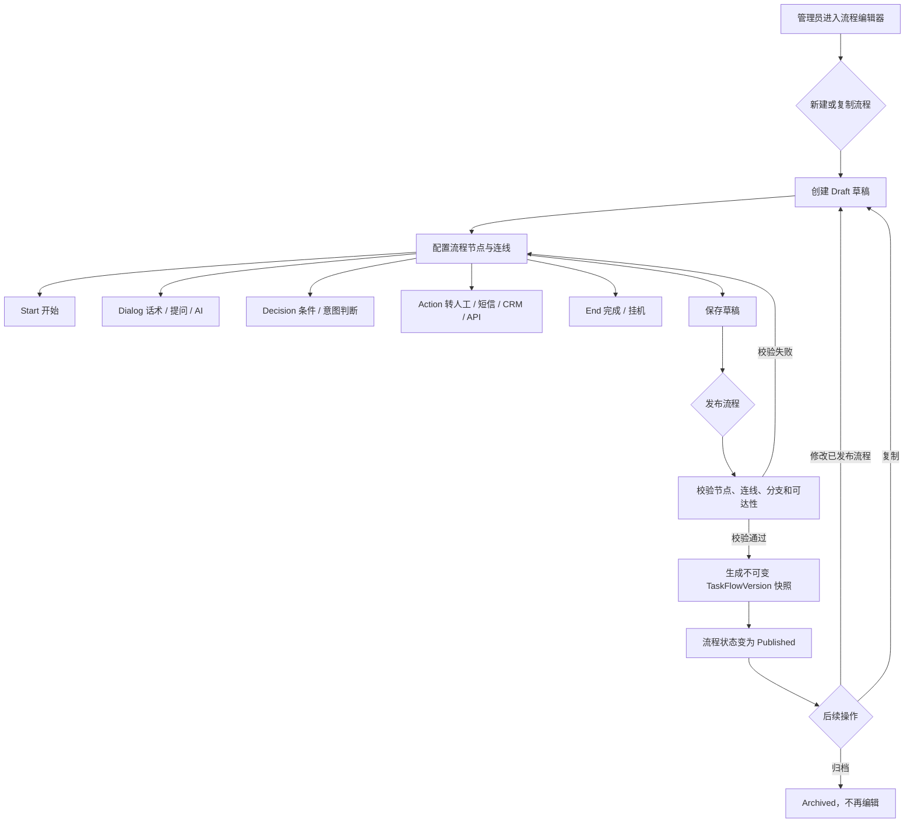
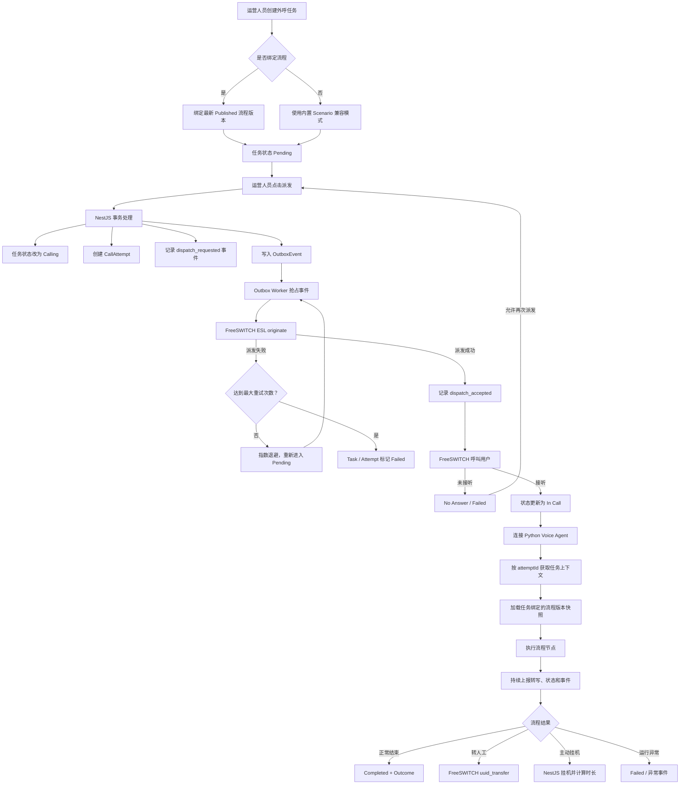
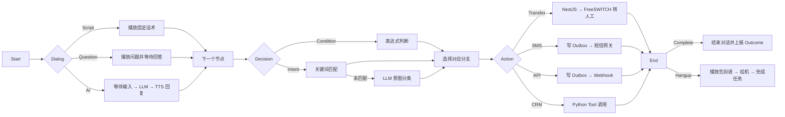

# 外呼流程管理业务流程图

本文档基于当前项目实现，梳理外呼流程的配置发布、任务执行和 Python 对话引擎节点执行过程。

## 1. 流程配置与发布



发布时执行以下结构校验：

- 只能存在一个开始节点。
- 至少存在一个结束节点。
- 非结束节点必须具有出口。
- 判断节点至少具有两个带标签的分支。
- 意图判断节点的分支需要覆盖配置的意图。
- 所有节点必须能够从开始节点到达。

任务创建后绑定具体的 `TaskFlowVersion`，因此后续修改流程不会影响已经创建的外呼任务。

## 2. 外呼任务执行主流程



任务与拨打尝试分开管理：一个 `OutboundTask` 可以产生多个 `CallAttempt`，每次派发都有独立的尝试编号、状态、时长和失败原因。

## 3. Python 对话引擎节点执行



职责边界如下：

- NestJS 是控制面，负责流程版本、任务状态、事件、外呼派发和可靠动作投递。
- Python Voice Agent 是执行面，负责 ASR、LLM、TTS、会话状态和流程节点编排。
- FreeSWITCH 负责呼叫控制、媒体通道、转接和挂机。
- PostgreSQL 保存流程快照、任务、拨打尝试、转写、事件和 Outbox 数据。

## 4. 当前实现注意项

1. `scheduledAt` 会由 API 进程内的 `TaskSchedulerService` 扫描，到点的 `pending` 任务自动进入 `dispatch()`，并写入 `CallAttempt` 与 `OutboxEvent`。可通过 `TASK_SCHEDULER_ENABLED=false` 关闭。
2. 转人工节点中的 `extension` / `queueId` 会经 Python FlowExecutor、WebSocketCallbacks 传递到 NestJS `POST /tasks/:id/transfer`，未配置时才回落到默认分机 `9000`。
3. 流程 `hangup` 结束节点会调用 NestJS `POST /tasks/:id/hangup`；NestJS 尝试执行 FreeSWITCH `uuid_kill`，并在数据库记录 `completed`、时长和 `call.hung_up` 事件。Python 客户端兼容同步 `200` 和异步 `202`。

## 5. 主要代码位置

- 流程管理：`apps/api/src/task-flows/task-flows.service.ts`
- 流程发布校验：`packages/shared/src/flow-validation.ts`
- 外呼任务控制：`apps/api/src/tasks/tasks.service.ts`
- 可靠事件投递：`apps/api/src/tasks/outbox.worker.ts`
- Python 流程执行器：`services/voice-agent/src/voice_agent/flow_executor.py`
- Python 会话入口：`services/voice-agent/src/voice_agent/agent.py`
- 数据模型：`apps/api/prisma/schema.prisma`

## 6. 自动化验证

无真实线路时可先跑控制面闭环 smoke test，验证创建任务、锁定流程版本、到点派发、Outbox 投递、接通状态、转写、转人工和挂机事件：

```bash
pnpm test:outbound-flow
```

或直接运行：

```bash
I:\ai-call\apps\api\node_modules\.bin\tsx.CMD --test I:\ai-call\apps\api\src\tasks\outbound-business-flow.spec.ts
```

完整回归建议同时运行：

```bash
I:\ai-call\node_modules\.bin\tsc.CMD -p I:\ai-call\apps\api\tsconfig.json --noEmit
I:\ai-call\apps\api\node_modules\.bin\tsx.CMD --test I:\ai-call\apps\api\src\**\*.spec.ts
python -m pytest services/voice-agent/tests/test_vad.py services/voice-agent/tests/test_server_callbacks.py services/voice-agent/tests/test_agent.py -q
```

其中 `services/voice-agent/tests/test_server_callbacks.py` 覆盖 FreeSWITCH `attemptId`
进入 `/audio-stream` 后，Voice Agent 拉任务上下文、回写 `in_call`、执行锁定流程并触发
`transfer` / `hangup` 的服务级链路。

服务启动后可运行本机 runtime smoke，检查 PostgreSQL、API、Dashboard、Voice Agent、
FunASR、FreeSWITCH ESL 端口，并通过 API 创建一个绑定已发布流程的 `1001` 外呼任务：

```bash
pnpm smoke:outbound-runtime
```

如果只想检查端口，不创建任务：

```bash
powershell -ExecutionPolicy Bypass -File scripts/outbound-runtime-check.ps1 -SkipTask
```

默认使用 seed 管理员 `admin@ai-call.local` / `admin123` 登录；可通过
`-AdminEmail`、`-AdminPassword`、`-To` 和 `-DispatchNow` 覆盖。
